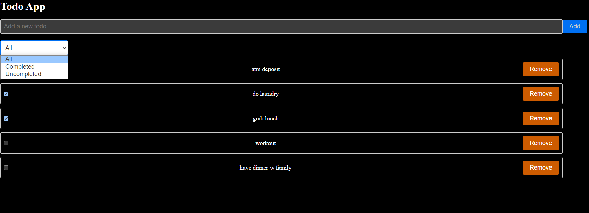

This project is under a training plan for being a web frontend engineer. \
Below are the key results: one homework and a presentation that comprises the concepts and usage of redux/redux toolkit. 

### Homework 7 Todo list
- Basic requirement:
    - add todo item (store in redux states) 
    - filter with all / active / completed
- Advanced:
    - decorates UI with Scss/Sass
- [Implementation](https://todo-app-rayhungkaos-projects.vercel.app/)
    - deployment on Vercel
- 

### Presentation
[Week4: Redux and Sass/SCSS](https://docs.google.com/presentation/d/1ItyGFcs_dAV6hNoFGIrGfQPLN-A9HcOaiJrw9LJEqNk/edit?usp=sharing), which includes: 
#### Part 1: redux
- Why and What is redux
- When to adopt redux
- How to use redux
- Actions, reducers, store, async actions
- Redux toolkit
- How to use redux toolkit
#### Part 2: Sass, Scss
- Variables, nesting, mixins, functions
- Demo of hw7 and hw8
- Other concepts: context vs redux, etc.